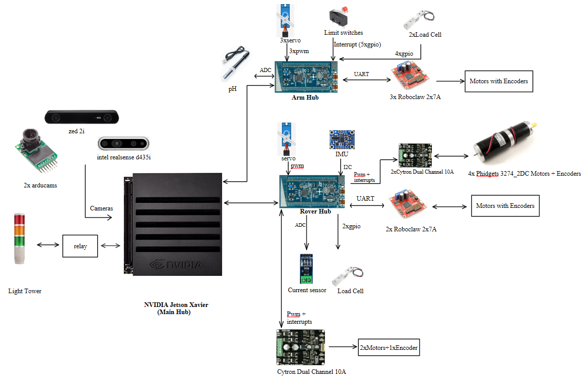

# Low-Level-Software 🚀

Official repository for the ROAR Rover Embedded Systems. This project manages the hardware control, sensor fusion, and communication bridge between the physical actuators and the High-Level NVIDIA Jetson Xavier.

## 🏗 System Architecture

We have transitioned to a **4-Layer Abstraction Model** to ensure the code is modular, testable, and independent of specific hardware changes.

1. **MCAL (Microcontroller Abstraction Layer):** Hardware-specific drivers (STM32 HAL).
2. **ECAL (Electronic Abstraction Layer):** Drivers for external components (Roboclaw, Cytron, HX711, IMU).
3. **Mission Layer:** High-level robot logic and task sequences (e.g., Drilling sequence, Arm Homing).
4. **App Layer:** Entry point managing the Micro-ROS executor and system timing.

---

## 📂 Project Directory Structure

```plaintext
Low-Level-Software/
│
├── firmware/                   # Integrated Production Firmware
│   ├── arm_node/               # STM32F412: 6-DOF Arm
│   │   ├── ECAL/               # Arm drivers (pH, Servos, Load cell, Roboclaws)
│   │   ├── Mission/            # Arm logic (Sampling, Homing sequences)
│   │   └── App/                # micro-ROS configuration & Main Loop
│   │
│   └── rover_node/             # STM32F412: Drivetrain & Drilling
│       ├── ECAL/               # Rover drivers (IMU, Cytron, Load cell, Roboclaws, Current sensors)
│       ├── Mission/            # Rover logic (Drilling , Drive control)
│       └── App/                # micro-ROS configuration & Main Loop
│
├── middleware/                 # Shared system-wide libraries
│   ├── micro_ros_stm32f401/    
│   └── micro_ros_stm32f412/
├── shared/                     # Cross-platform source code
│   ├── drivers/                # Common drivers (e.g., Roboclaw Packet Serial)
│   └── include/                # Global constants and Pin Definitions
│
├── testing/                    # Sandbox for R&D (Pre-Integration)
│   ├── load_cell_test/         
│   ├── servo_pwm_test/
│   ├── micro_ros_bench/
│   ├── micro_ros_imu/
│   └── micro_ros_roboclaw/
│
├── docs/                       # Pinouts, Wiring Diagrams, and Datasheets
└── README.md                   # System Overview <-- You are here
```

## System integration

### system plan



### final system

```plaintext
Loading...
```
